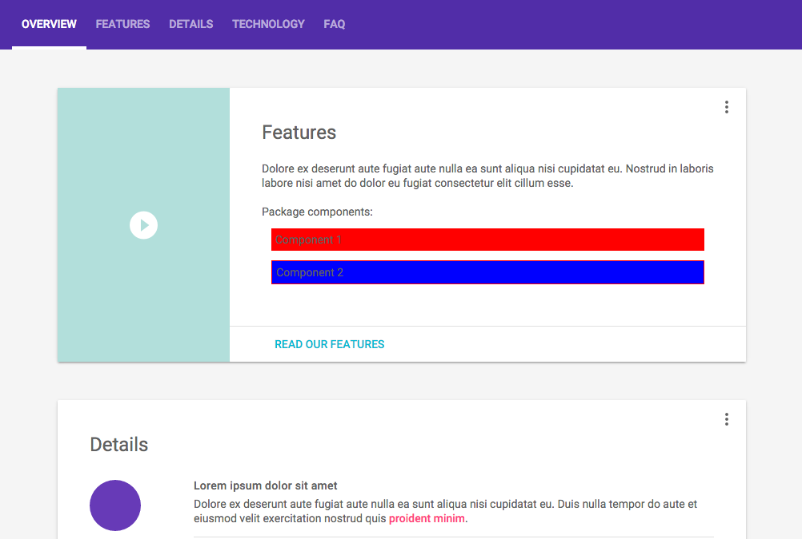

# SAMPLE for SASS-Var-Transformer
> text_only-Material sample to show functionality

Screenshot shows a mix between Global-Package-Style (Material Design by mdl4dart) and
Local-Package-Style: Component1 + Component2



index.html:
```html
<link rel="stylesheet" href="material.css">
<link rel="stylesheet" href="styles.css">

<link rel="stylesheet" href="packages/text_only/assets/component1/cmp1.css">
<link rel="stylesheet" href="packages/text_only/assets/component2/cmp2.css">
```

cmp2.scss:
```scss
@import "@text_only/assets/component1/variables";
@import "./variables";

.cmp2 {
    border: 1px solid $component1__element1;
    background-color: $component2__element1;
    margin: $global_margin;
    padding: $global_padding;
}
```
